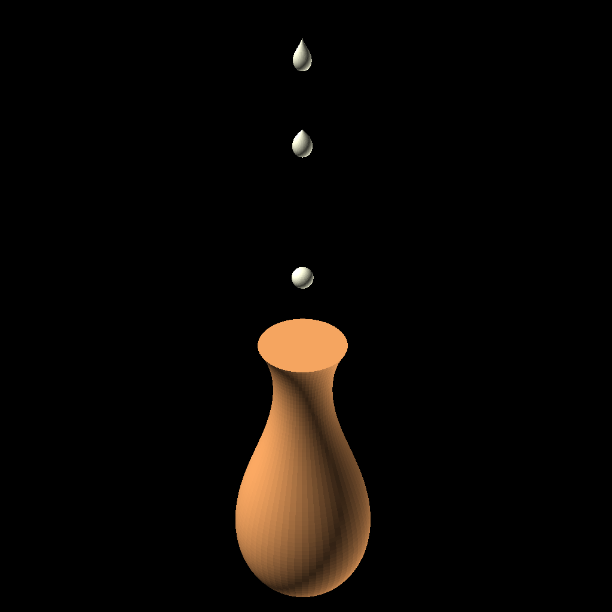

# Stylistic Droplet

Let's draw a stylistic droplet shape profile with smoothly varying curvature.

Curvature is the change in curve direction over a small distance traveled (e.g. angle per unit length in rad/m).  A good analogy for curvature is the turning radius of an automobile, which is determined by the steering wheel position.  Start with the steering wheel full lock to the left, and while the vehicle moves gradually turn the steering wheel clockwise (to the right).  The vehicle traverses a curvy track.

Similarly we can start drawing at the origin with unit curvature, and change direction slightly each stroke forward.  We only need to trace half of a symmetric profile.  When we rotate this half profile like a jump rope, we get a stylistic droplet 3D shape.

The C code generates OpenSCAD code in the standard output, which can be redirected to a file.  The file should be ready-to-run in OpenSCAD, and renders a droplet of your design.  The C code accepts up to 3 command line parameters.  Without parameters, the code by default will generate OpenSCAD code to draw a pinpoint droplet that looks like hanging by a thread.

The command line parameters [default value] are:

	initial direction (degree: 0 due east; -90 due south) [-90]
	iterations to reduce unit curvature to zero [10]
	draw up to this number of segments (max iterations) [64]

The sample parameters for the objects shown are, respectively, from top to bottom:
	0 46.5 64
	0 52 64
	0 999 64
	0 43 74

The objects may be colored, scaled, and translated in OpenSCAD to suit your composition.

The last object looks more like a vase than a droplet.  This demonstrates the versatility of drawing by curvature.

The code has been tested with gcc on linux and with clang on MacOS.

August 16, 2025
